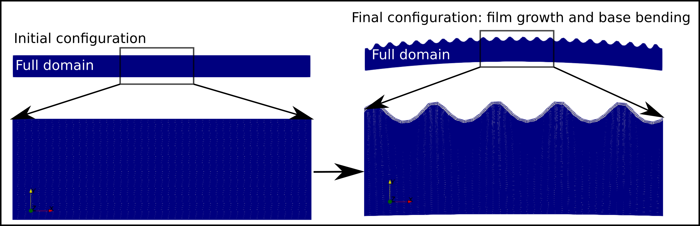

## Support repository for several works investigating wrinkled surfaces in soft-matter surfaces.

A document describing details about the geometry domain, mesh preparation and solution methods, for the scripts available here
can be found [here](view.pdf).

The scripts are written in python 3x and require a working version of [FEniCs](https://fenicsproject.org/) and basic knowledge of the FEniCs/dolfin framework. The script for the elastomer wrinkling due to stretching also requires [FEniCs mechanics](https://www.sciencedirect.com/science/article/pii/S2352711018300979).

There are three main scripts in the SCRIPTS folder.

## MONOSTRETCH- Stretching of a slender monolayer volume.

The script is called **slab.py** and it is self contained. It should leads to solutions such as the one below: 

It generates on the fly a three dimensional dolfin mesh over which we solve the finite element problem. It works well with **mpi** under unix/linux out of the box, for other OS such as windows or apple I can not guarantee it.  An example of how to use mpi is: `mpirun -n 8 python slab.py`
 which will run the script using 8 cores. A similar command works for the next two cases. 

## BISTRETCH - Compression of a bilayer composite.

For this case the script is called **Nbbz.py** and it is not self contained as an external mesh is generated in another script called **N3mesh.py**, once the mesh is generated the execution of the script `mpirun -n 8 python Nbbz.py` leads to solutions such as the one below. 

For both previous cases the material is assumed to be Neo-Hookean. The former incompressible, thus solving a mixed space finite element problem. Whereas the latter near incompressible. On both cases the solution is found by displacing the boundary surfaces accordingly and computing the elastic response to such displacements, the configurations obtained are the equilibrium configurations.

## GROWTH3D - Morphoelastic growth of a bilayer composite.

This problem assumes volumetric expansion of the subdomains, the kinematic formulation is slightly more complicated than for the previous two systems, again the scripts provided correspond to a mesh generation script named **N3mesh.py** and the solution script **bbz.py**. For this case the growth tensors can be specified and updated on execution time providing great flexibilty to study several interesting cases. Such as the ones shown below for two and three dimensional systems.

  

Shield: [![CC BY 4.0][cc-by-shield]][cc-by]

This work is licensed under a
[Creative Commons Attribution 4.0 International License][cc-by].

[![CC BY 4.0][cc-by-image]][cc-by]

[cc-by]: http://creativecommons.org/licenses/by/4.0/
[cc-by-image]: https://i.creativecommons.org/l/by/4.0/88x31.png
[cc-by-shield]: https://img.shields.io/badge/License-CC%20BY%204.0-lightgrey.svg

